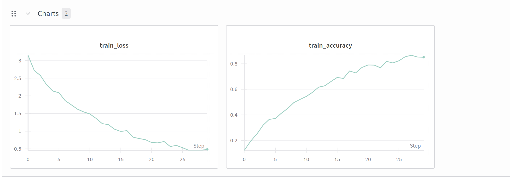
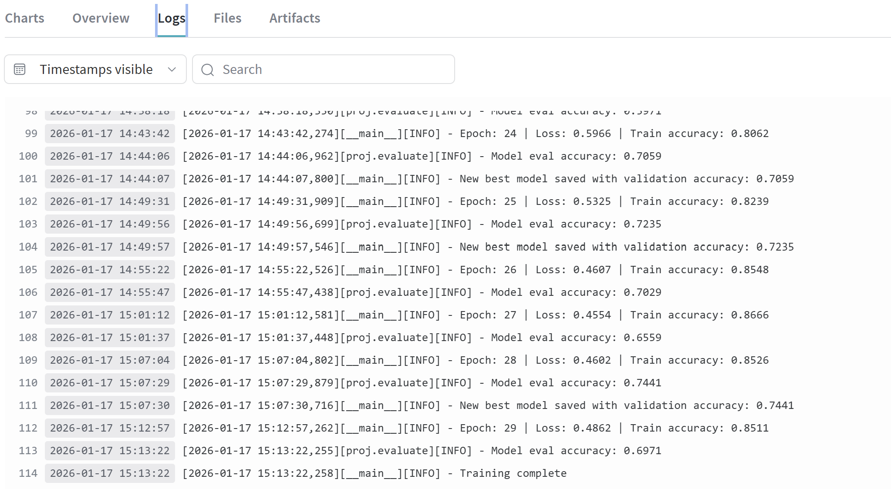
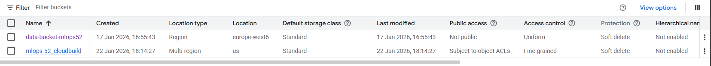
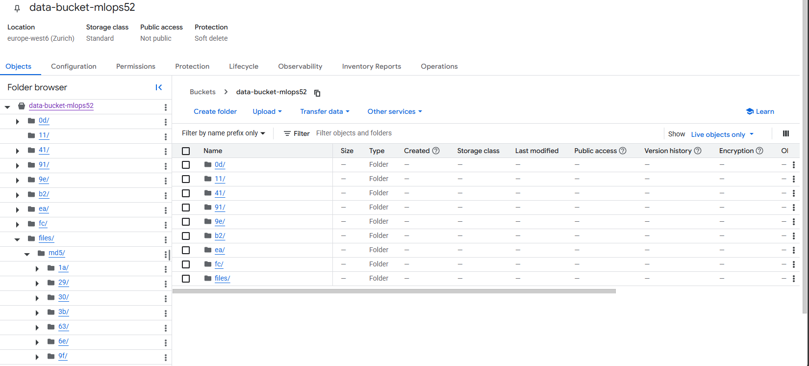
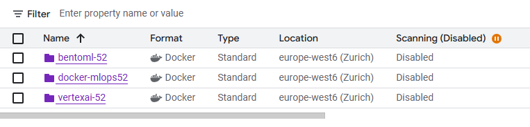
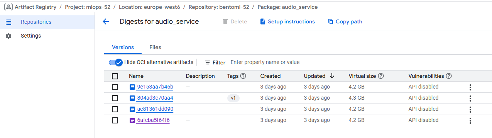
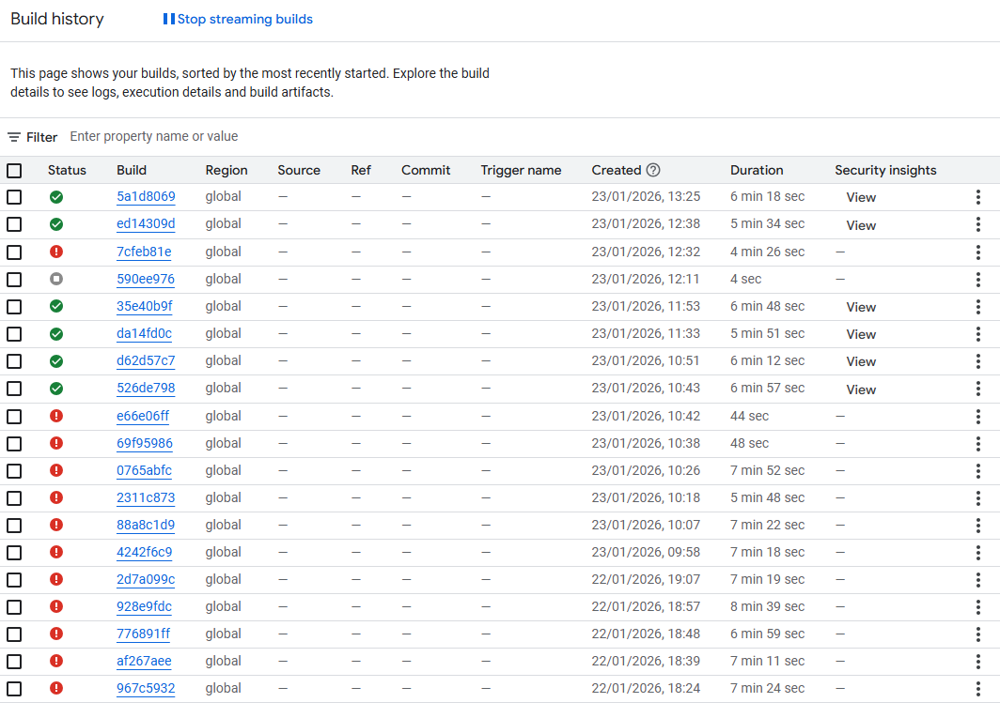

# Exam template for 02476 Machine Learning Operations

This is the report template for the exam. Please only remove the text formatted as with three dashes in front and behind
like:

```--- question 1 fill here ---```

Where you instead should add your answers. Any other changes may have unwanted consequences when your report is
auto-generated at the end of the course. For questions where you are asked to include images, start by adding the image
to the `figures` subfolder (please only use `.png`, `.jpg` or `.jpeg`) and then add the following code in your answer:

``

In addition to this markdown file, we also provide the `report.py` script that provides two utility functions:

Running:

```bash
python report.py html
```

Will generate a `.html` page of your report. After the deadline for answering this template, we will auto-scrape
everything in this `reports` folder and then use this utility to generate a `.html` page that will be your serve
as your final hand-in.

Running

```bash
python report.py check
```

Will check your answers in this template against the constraints listed for each question e.g. is your answer too
short, too long, or have you included an image when asked. For both functions to work you mustn't rename anything.
The script has two dependencies that can be installed with

```bash
pip install typer markdown
```

or

```bash
uv add typer markdown
```

## Overall project checklist

The checklist is *exhaustive* which means that it includes everything that you could do on the project included in the
curriculum in this course. Therefore, we do not expect at all that you have checked all boxes at the end of the project.
The parenthesis at the end indicates what module the bullet point is related to. Please be honest in your answers, we
will check the repositories and the code to verify your answers.

### Week 1

- [x]  Create a git repository (M5)
- [x]  Make sure that all team members have write access to the GitHub repository (M5)
- [x]  Create a dedicated environment for you project to keep track of your packages (M2)
- [x]  Create the initial file structure using cookiecutter with an appropriate template (M6)
- [x]  Fill out the `data.py` file such that it downloads whatever data you need and preprocesses it (if necessary) (M6)
- [x]  Add a model to `model.py` and a training procedure to `train.py` and get that running (M6)
- [x]  Remember to either fill out the `requirements.txt`/`requirements_dev.txt` files or keeping your `pyproject.toml`/`uv.lock` up-to-date with whatever dependencies that you are using (M2+M6)
- [x]  Remember to comply with good coding practices (`pep8`) while doing the project (M7)
- [x]  Do a bit of code typing and remember to document essential parts of your code (M7)
- [x]  Setup version control for your data or part of your data (M8)
- [ ]  Add command line interfaces and project commands to your code where it makes sense (M9)
- [x]  Construct one or multiple docker files for your code (M10)
- [x]  Build the docker files locally and make sure they work as intended (M10)
- [x]  Write one or multiple configurations files for your experiments (M11)
- [x]  Used Hydra to load the configurations and manage your hyperparameters (M11)
- [ ]  Use profiling to optimize your code (M12)
- [x]  Use logging to log important events in your code (M14)
- [x]  Use Weights & Biases to log training progress and other important metrics/artifacts in your code (M14)
- [x]  Consider running a hyperparameter optimization sweep (M14)
- [x]  Use PyTorch-lightning (if applicable) to reduce the amount of boilerplate in your code (M15)

### Week 2

- [x]  Write unit tests related to the data part of your code (M16)
- [x]  Write unit tests related to model construction and or model training (M16)
- [x]  Calculate the code coverage (M16)
- [x]  Get some continuous integration running on the GitHub repository (M17)
- [x]  Add caching and multi-os/python/pytorch testing to your continuous integration (M17)
- [x]  Add a linting step to your continuous integration (M17)
- [x]  Add pre-commit hooks to your version control setup (M18)
- [x]  Add a continues workflow that triggers when data changes (M19)
- [x]  Add a continues workflow that triggers when changes to the model registry is made (M19)
- [x]  Create a data storage in GCP Bucket for your data and link this with your data version control setup (M21)
- [x]  Create a trigger workflow for automatically building your docker images (M21)
- [x]  Get your model training in GCP using either the Engine or Vertex AI (M21)
- [ ]  Create a FastAPI application that can do inference using your model (M22)
- [x]  Deploy your model in GCP using either Functions or Run as the backend (M23)
- [x]  Write API tests for your application and setup continues integration for these (M24)
- [ ]  Load test your application (M24)
- [x]  Create a more specialized ML-deployment API using either ONNX or BentoML, or both (M25)
- [ ]  Create a frontend for your API (M26)

### Week 3

- [ ]  Check how robust your model is towards data drifting (M27)
- [ ]  Setup collection of input-output data from your deployed application (M27)
- [ ]  Deploy to the cloud a drift detection API (M27)
- [ ]  Instrument your API with a couple of system metrics (M28)
- [ ]  Setup cloud monitoring of your instrumented application (M28)
- [x]  Create one or more alert systems in GCP to alert you if your app is not behaving correctly (M28)
- [x]  If applicable, optimize the performance of your data loading using distributed data loading (M29)
- [x]  If applicable, optimize the performance of your training pipeline by using distributed training (M30)
- [x]  Play around with quantization, compilation and pruning for you trained models to increase inference speed (M31)

### Extra

- [x]  Write some documentation for your application (M32)
- [ ]  Publish the documentation to GitHub Pages (M32)
- [x]  Revisit your initial project description. Did the project turn out as you wanted?
- [x]  Create an architectural diagram over your MLOps pipeline
- [x]  Make sure all group members have an understanding about all parts of the project
- [x]  Uploaded all your code to GitHub

## Group information

### Question 1
> **Enter the group number you signed up on <learn.inside.dtu.dk>**
>
> Answer:

55

### Question 2
> **Enter the study number for each member in the group**
>
> Example:
>
> *sXXXXXX, sXXXXXX, sXXXXXX*
>
> Answer:

s252979, s253462, s243076, s253128

### Question 3
> **Did you end up using any open-source frameworks/packages not covered in the course during your project? If so**
> **which did you use and how did they help you complete the project?**
>
> Recommended answer length: 0-200 words.
>
> Example:
> *We used the third-party framework ... in our project. We used functionality ... and functionality ... from the*
> *package to do ... and ... in our project*.
>
> Answer:

No.

## Coding environment

> In the following section we are interested in learning more about you local development environment. This includes
> how you managed dependencies, the structure of your code and how you managed code quality.

### Question 4

> **Explain how you managed dependencies in your project? Explain the process a new team member would have to go**
> **through to get an exact copy of your environment.**
>
> Recommended answer length: 100-200 words
>
> Example:
> *We used ... for managing our dependencies. The list of dependencies was auto-generated using ... . To get a*
> *complete copy of our development environment, one would have to run the following commands*
>
> Answer:

We managed dependencies using `uv` and a `pyproject.toml` file, which serves as the single source of truth for both production and development packages (adhering to PEP 621). For reproducibility across all environments, we committed a `uv.lock` file that pins every dependency to a specific version. For development, a new team member simply clones the repository and runs `uv sync`, which automatically creates and populates a virtual environment identical to the rest of the team's. This strategy extends also to our Docker setup. Our Dockerfiles utilize the official `ghcr.io/astral-sh/uv` base image and execute `uv sync --locked --no-dev`. So, the containerized application runs with the exact same dependency versions as our local development setups, preventing "it works on my machine" issues and simplifying the transition from local coding to cloud deployment. 

### Question 5

> **We expect that you initialized your project using the cookiecutter template. Explain the overall structure of your**
> **code. What did you fill out? Did you deviate from the template in some way?**
>
> Recommended answer length: 100-200 words
>
> Example:
> *From the cookiecutter template we have filled out the ... , ... and ... folder. We have removed the ... folder*
> *because we did not use any ... in our project. We have added an ... folder that contains ... for running our*
> *experiments.*
>
> Answer:

From the cookiecutter template we have filled out the `src/`, `configs/`, `data/`, and `tests/` folders. We have removed the notebooks folder because we did not use any notebooks in our project. The `src/` folder contains `data.py` for data loading and preprocessing, `model.py` for the ResNet34 model architecture, and `train_lightning.py` for the training pipeline using PyTorch Lightning. Additionally, we added a `distributed_training.py` module to implement distributed training using PyTorch's DDP. The `configs/` folder contains Hydra configuration files (`hydra_cfg.yaml`, `model_cfg.yaml`, `train_cfg.yaml`) for managing hyperparameters and model settings. We also created `dockerfiles/` to containerize our training, evaluation, and deployment environments. The `.github/workflows/` directory contains our CI/CD pipelines. Overall, we kept the project structure close to the template.

### Question 6

> **Did you implement any rules for code quality and format? What about typing and documentation? Additionally,**
> **explain with your own words why these concepts matters in larger projects.**
>
> Recommended answer length: 100-200 words.
>
> Example:
> *We used ... for linting and ... for formatting. We also used ... for typing and ... for documentation. These*
> *concepts are important in larger projects because ... . For example, typing ...*
>
> Answer:

We used ruff (configured in .pre-commit-config.yaml and pyproject.toml) together with pep8 conventions for linting and automatic formatting (ruff --fix and ruff-format). Pre-commit hooks enforce these rules before commits. Dependency and environment reproducibility is handled via pyproject.toml and uv. For typing we applied Python type hints across modules to document interfaces and catch errors.
These practices matter in larger projects because they increase maintainability, reduce subtle bugs, and speed onboarding. Consistent formatting and linting make code review efficient; typing clarifies intent and enables safer refactoring; and good docs preserve institutional knowledge so teams can scale without losing productivity.

## Version control

> In the following section we are interested in how version control was used in your project during development to
> corporate and increase the quality of your code.

### Question 7

> **How many tests did you implement and what are they testing in your code?**
>
> Recommended answer length: 50-100 words.
>
> Example:
> *In total we have implemented X tests. Primarily we are testing ... and ... as these the most critical parts of our*
> *application but also ... .*
>
> Answer:

We implemented tests across 5 modules/files: tests/test_data.py, tests/test_train.py, tests/test_evaluate.py, test_api.py and tests/performancetests/test_model.py. They verify data downloading and preprocessing, dataset statistics/integrity, training pipeline and checkpointing, evaluation metrics and model outputs, API endpoint behavior and responses, and a performance test checking model inference behavior and speed.

### Question 8

> **What is the total code coverage (in percentage) of your code? If your code had a code coverage of 100% (or close**
> **to), would you still trust it to be error free? Explain you reasoning.**
>
> Recommended answer length: 100-200 words.
>
> Example:
> *The total code coverage of code is X%, which includes all our source code. We are far from 100% coverage of our **
> *code and even if we were then...*
>
> Answer:

The total code coverage is 49% (coverage report: src/proj/ — total 277 lines, 141 missed). Several core modules (data.py, model.py, data_module.py, lightning_model.py) have low coverage, while evaluate.py and train_lightning.py are better but still incomplete.
Even if coverage were close to 100%, I would not assume the code is error free. Line coverage only shows which lines were executed by tests, not that all edge cases, integration paths, performance characteristics, or environment-specific failures are exercised. Tests can miss wrong assumptions, data distribution shifts, race conditions, numerical instability, and external-system failures. To improve trustworthiness we should add focused unit tests for edge cases and property-based tests, so coverage reflects meaningful behavioral guarantees rather than just executed lines.

### Question 9

> **Did you workflow include using branches and pull requests? If yes, explain how. If not, explain how branches and**
> **pull request can help improve version control.**
>
> Recommended answer length: 100-200 words.
>
> Example:
> *We made use of both branches and PRs in our project. In our group, each member had an branch that they worked on in*
> *addition to the main branch. To merge code we ...*
>
> Answer:

We used feature branches and pull requests for all non-trivial changes. Each new task was developed on a dedicated branch named by feature or issue (e.g., feature/data, fix/api-test-bug). Changes were merged first into a protected dev branch via pull requests after at least one review and passing CI (unit tests, linting, coverage checks). The dev branch accumulated integration-ready work and was periodically merged into main using reviewed, squash merges to keep history tidy. Pre-commit hooks and CI runs enforced style, tests, and security checks on every PR. This workflow improved collaboration, reduced risky direct pushes to main, and ensured automated validation before merging.

### Question 10

> **Did you use DVC for managing data in your project? If yes, then how did it improve your project to have version**
> **control of your data. If no, explain a case where it would be beneficial to have version control of your data.**
>
> Recommended answer length: 100-200 words.
>
> Example:
> *We did make use of DVC in the following way: ... . In the end it helped us in ... for controlling ... part of our*
> *pipeline*
>
> Answer:

Yes, we utilized DVC to manage our project's data. We configured a Google Cloud Storage bucket (`gs://data-bucket-mlops52`) as our remote backend, which allowed us to version control ~1.8GB of data while keeping our Git repository lightweight. DVC improved our project by making sure that we all worked with the same data version and by decoupling code development from data management. It also was handy when working on Vertex AI (on GCP), as it allowed us to pull the data from the bucket and use it for training without having to push it inside the docker container.

### Question 11

> **Discuss you continuous integration setup. What kind of continuous integration are you running (unittesting,**
> **linting, etc.)? Do you test multiple operating systems, Python  version etc. Do you make use of caching? Feel free**
> **to insert a link to one of your GitHub actions workflow.**
>
> Recommended answer length: 200-300 words.
>
> Example:
> *We have organized our continuous integration into 3 separate files: one for doing ..., one for running ... testing*
> *and one for running ... . In particular for our ..., we used ... .An example of a triggered workflow can be seen*
> *here: <weblink>*
>
> Answer:

We have organized our continuous integration into multiple separate files. The `tests.yaml` workflow runs unit testing with pytest on every push to main/dev branches and pull requests. We test across multiple operating systems (ubuntu-latest and windows-latest) to ensure compatibility. The workflow uses caching via the `astral-sh/setup-uv` action with `enable-cache: true` for faster dependency installation, significantly reducing CI runtime. The `codecheck.yaml` workflow handles linting and formatting checks using Ruff, running `ruff check . --fix` and `ruff format . --check` to enforce code quality standards on every commit. The `build-image.yaml` file automatically builds and pushes Docker images to Google Artifact Registry when changes to dockerfiles, source code, or dependencies are detected in the main branch. The `cml_data.yaml` file triggers when any of the DVC files change, automatically pulling data from GCP, preprocessing it, generating dataset statistics, and posting visualization reports as PR comments using CML. The `stage_model.yaml` workflow is triggered via repository dispatch events when models are staged in Weights & Biases and it automatically runs performance tests on the staged model and adds production aliases if tests pass. All workflows use the `uv` package manager for dependency management. Pre-commit hooks are configured in `.pre-commit-config.yaml` to run Ruff checks and automatically compile requirements.txt before commits. An example of a triggered workflow can be seen here: https://github.com/AndreaZanasi/Project_MLOps_G55/actions/runs/21258714244/job/61180417185

## Running code and tracking experiments

> In the following section we are interested in learning more about the experimental setup for running your code and
> especially the reproducibility of your experiments.

### Question 12

> **How did you configure experiments? Did you make use of config files? Explain with coding examples of how you would**
> **run a experiment.**
>
> Recommended answer length: 50-100 words.
>
> Example:
> *We used a simple argparser, that worked in the following way: Python  my_script.py --lr 1e-3 --batch_size 25*
>
> Answer:

We used Hydra for experiment configuration. Configuration files in `configs/` folder define all hyperparameters and model settings in YAML format. To run an experiment: `uv run src/proj/train_lightning.py` loads default configs. To override: `uv run src/proj/train_lightning.py hyperparameters.learning_rate=1e-4 hyperparameters.batch_size=32`. Hydra automatically creates configurations and timestamped output directories with experiment runs, ensuring reproducibility and organization of multiple experimental runs.

### Question 13

> **Reproducibility of experiments are important. Related to the last question, how did you secure that no information**
> **is lost when running experiments and that your experiments are reproducible?**
>
> Recommended answer length: 100-200 words.
>
> Example:
> *We made use of config files. Whenever an experiment is run the following happens: ... . To reproduce an experiment*
> *one would have to do ...*
>
> Answer:

We made use of config files in `configs/` folder. First, Hydra automatically saves all configuration files to timestamped output directories (`outputs/{date}/{time}/`), preserving exact experimental settings. Then we use Weights & Biases for logging of all metrics, hyperparameters, model artifacts, and training statistics. Every experiment run is logged with full config information stored in W&B. Additionally, we version our dependencies with `uv.lock` file to make sure that exact package versions are reproducible. Finally, we also save model checkpoints with validation metrics in filenames, allowing to easily identificate the best performing models. To reproduce an experiment, one would have to retrieve the config files from W&B or the output directory, ensure identical environment by running `uv sync --locked`, and re-run with the same Hydra overrides. DVC is also configured to track data pipeline reproducibility.

### Question 14

> **Upload 1 to 3 screenshots that show the experiments that you have done in W&B (or another experiment tracking**
> **service of your choice). This may include loss graphs, logged images, hyperparameter sweeps etc. You can take**
> **inspiration from [this figure](figures/wandb.png). Explain what metrics you are tracking and why they are**
> **important.**
>
> Recommended answer length: 200-300 words + 1 to 3 screenshots.
>
> Example:
> *As seen in the first image when have tracked ... and ... which both inform us about ... in our experiments.*
> *As seen in the second image we are also tracking ... and ...*
>
> Answer:

. . W&B's centralized logging system enables easy comparison across multiple experimental runs, facilitating hyperparameter optimization and model selection. The logged artifacts and configurations are essential for reproducibility and model deployment, as we can retrieve the exact model version and settings that produced the best results.

### Question 15

> **Docker is an important tool for creating containerized applications. Explain how you used docker in your**
> **experiments/project? Include how you would run your docker images and include a link to one of your docker files.**
>
> Recommended answer length: 100-200 words.
>
> Example:
> *For our project we developed several images: one for training, inference and deployment. For example to run the*
> *training docker image: `docker run trainer:latest lr=1e-3 batch_size=64`. Link to docker file: <weblink>*
>
> Answer:

We utilized Docker to containerize our training and inference environments, which allowed for consistency across local development and cloud execution. We created multiple Dockerfiles for different purposes: `train_cpu.dockerfile` for local testing on CPU, `train_gpu.dockerfile` for GPU-accelerated training, and `vertex_train.dockerfile` specifically for running training jobs on Google Cloud Vertex AI. The Vertex AI image extends the official NVIDIA PyTorch image, installs `uv` for dependency management, and configures DVC to pull data dynamically at runtime. This separation allows us to keep the image lightweight while ensuring the exact data and code versions are used.
To build and run the local training image, we use:
```bash
docker build -f dockerfiles/train_cpu.dockerfile -t train_cpu:latest .
docker run --rm train_cpu:latest
```
Link to docker file: [dockerfiles/train_cpu.dockerfile](dockerfiles/train_cpu.dockerfile)

### Question 16

> **When running into bugs while trying to run your experiments, how did you perform debugging? Additionally, did you**
> **try to profile your code or do you think it is already perfect?**
>
> Recommended answer length: 100-200 words.
>
> Example:
> *Debugging method was dependent on group member. Some just used ... and others used ... . We did a single profiling*
> *run of our main code at some point that showed ...*
>
> Answer:

We debugged primarily with targeted unit tests, extensive logging, and interactive runs. Failing tests were reproduced locally using `uv run pytest tests/` and traced with module-level logs to locate issues. For quick checks we ran small scripts with `uv run` to exercise specific functions, used assertions and short ad-hoc prints to validate assumptions, and inspected artifacts in W&B to spot anomalies. We did not run a formal profiler since training and data handling were already fast. We plan to add cProfile/pyinstrument-based profiling if performance bottlenecks appear.

## Working in the cloud

> In the following section we would like to know more about your experience when developing in the cloud.

### Question 17

> **List all the GCP services that you made use of in your project and shortly explain what each service does?**
>
> Recommended answer length: 50-200 words.
>
> Example:
> *We used the following two services: Engine and Bucket. Engine is used for... and Bucket is used for...*
>
> Answer:

We utilized the Google Cloud Platform ecosystem to support our MLOps pipeline in a lot of different steps. We used Cloud Storage (Buckets) as the backend for DVC to store our datasets and training artifacts. For container management, Artifact Registry was the central repository for hosting and versioning the Docker images used in training and inference. To automate our build process in a CI/CD pipeline, we used Cloud Build, which triggered image builds automatically upon changes. We used Vertex AI to execute our training jobs in the cloud. Finally, for deployment, we hosted our inference API on a serverless environment provided by Cloud Run.

### Question 18

> **The backbone of GCP is the Compute engine. Explained how you made use of this service and what type of VMs**
> **you used?**
>
> Recommended answer length: 100-200 words.
>
> Example:
> *We used the compute engine to run our ... . We used instances with the following hardware: ... and we started the*
> *using a custom container: ...*
>
> Answer:

We use the Compute Engine only through managed services rather than managing raw VMs manually. For training on Vertex AI, we used Custom Training Jobs that spun up Compute Engine instances on demand. For deployment, Cloud Run abstracted the underlying Compute Engine instances, which resulted in a serverless execution environment that automatically scaled container instances (using vCPU and RAM configurations defined in our `bentofile.yaml`/deployment config) based on incoming request traffic. However, we did not use Compute Engine instances directly for training or inference.

### Question 19

> **Insert 1-2 images of your GCP bucket, such that we can see what data you have stored in it.**
> **You can take inspiration from [this figure](figures/bucket.png).**
>
> Answer:




### Question 20

> **Upload 1-2 images of your GCP artifact registry, such that we can see the different docker images that you have**
> **stored. You can take inspiration from [this figure](figures/registry.png).**
>
> Answer:




### Question 21

> **Upload 1-2 images of your GCP cloud build history, so we can see the history of the images that have been build in**
> **your project. You can take inspiration from [this figure](figures/build.png).**
>
> Answer:



### Question 22

> **Did you manage to train your model in the cloud using either the Engine or Vertex AI? If yes, explain how you did**
> **it. If not, describe why.**
>
> Recommended answer length: 100-200 words.
>
> Example:
> *We managed to train our model in the cloud using the Engine. We did this by ... . The reason we choose the Engine*
> *was because ...*
>
> Answer:

We containerized the PyTorch training code using Docker, used uv for dependency management and DVC to fetch data from Google Cloud Storage (GCS) at runtime. We used Google Cloud Build to compile the image directly in the cloud and push it to Artifact Registry. Finally, we submitted a Vertex AI Custom Job to provision the compute infrastructure. We chose Vertex AI as it is the latest, most robust machine learning platform on GCP.

## Deployment

### Question 23

> **Did you manage to write an API for your model? If yes, explain how you did it and if you did anything special. If**
> **not, explain how you would do it.**
>
> Recommended answer length: 100-200 words.
>
> Example:
> *We did manage to write an API for our model. We used FastAPI to do this. We did this by ... . We also added ...*
> *to the API to make it more ...*
>
> Answer:

We implemented the inference API using BentoML together with an exported ONNX model. The model is exported to ONNX (src/proj/api/export_onnx.py) and stored as a Bento artifact (src/proj/api/bento/artifacts). The Bento service (src/proj/api/bento/service.py) wraps the ONNXRuntime session, implements the predict endpoint, and loads the model at startup to avoid per-request overhead. BentoML was used to containerize and deploy the service (bentoml containerize / bentoml serve), providing a portable image suitable for Cloud Run. This setup gives fast, framework-agnostic inference and simplifies CI/CD and testing (tests/test_api.py covers endpoint behavior).

### Question 24

> **Did you manage to deploy your API, either in locally or cloud? If not, describe why. If yes, describe how and**
> **preferably how you invoke your deployed service?**
>
> Recommended answer length: 100-200 words.
>
> Example:
> *For deployment we wrapped our model into application using ... . We first tried locally serving the model, which*
> *worked. Afterwards we deployed it in the cloud, using ... . To invoke the service an user would call*
> *`curl -X POST -F "file=@file.json"<weburl>`*
>
> Answer:

We deployed the inference API to GCP Cloud. First we implemented the BentoML service (src/proj/api/bento/service.py) and exported the model (ONNX) as a Bento artifact (src/proj/api/export_onnx.py). We containerized the service using the bentofile.yaml (bentoml build / bentoml containerize) to generate a Docker image, pushed the image to Artifact Registry, and created a Cloud Run service to serve the container. The service loads the ONNX model at startup to avoid per-request loading and exposes /predict and /health endpoints. Example invocation:
curl -X POST -H "Content-Type: application/json" -d '{"audio_specs": <array>}' https://audio-service-685944380771.europe-west6.run.app/predict
or from Python: requests.post(URL, json={"audio_specs": array}).

### Question 25

> **Did you perform any unit testing and load testing of your API? If yes, explain how you did it and what results for**
> **the load testing did you get. If not, explain how you would do it.**
>
> Recommended answer length: 100-200 words.
>
> Example:
> *For unit testing we used ... and for load testing we used ... . The results of the load testing showed that ...*
> *before the service crashed.*
>
> Answer:

Unit testing is done with pytest (tests/test_api.py). The test suite loads real spectrogram samples from data/processed/test/test.pt via a module-scoped fixture, samples N_SAMPLES entries, and parameterizes requests so each sample is POSTed to the deployed /predict endpoint. Assertions check HTTP 200, presence of a "prediction" field and that the value is not an error. This verifies the end-to-end behavior (input serialization, model loading in the Bento/ONNX service, and response schema) against our Cloud Run endpoint. For load testing we would use Locust and collect metrics via GCP Cloud Monitoring.

### Question 26

> **Did you manage to implement monitoring of your deployed model? If yes, explain how it works. If not, explain how**
> **monitoring would help the longevity of your application.**
>
> Recommended answer length: 100-200 words.
>
> Example:
> *We did not manage to implement monitoring. We would like to have monitoring implemented such that over time we could*
> *measure ... and ... that would inform us about this ... behaviour of our application.*
>
> Answer:

We utilized the standard Google Cloud Monitoring that comes out-of-the-box with Cloud Run. This gave us immediate visibility into system-level metrics such as request latency, 5xx error rates, request counts, and container instance CPU/memory utilization. However, this approach is limited because it only measures system health, not model health. It cannot detect issues like data drift, model degradation, or model-serving skew since it lacks awareness of the model's inputs and outputs. To improve this, we would need to implement custom metrics logging or integrate a specialized ML monitoring tool.

## Overall discussion of project

> In the following section we would like you to think about the general structure of your project.

### Question 27

> **How many credits did you end up using during the project and what service was most expensive? In general what do**
> **you think about working in the cloud?**
>
> Recommended answer length: 100-200 words.
>
> Example:
> *Group member 1 used ..., Group member 2 used ..., in total ... credits was spend during development. The service*
> *costing the most was ... due to ... . Working in the cloud was ...*
>
> Answer:

In total, we used slightly above 7 DKK. The service that cost the most was definitely Vertex AI training, as the data was relatively lightweight (so cheap to host) and we didn't have many docker images on the cloud. In general we liked working with the cloud, it made most things easier, although some arguabily harder due to the general lack of depth of this project. We however don't doubt that in bigger and more complex workflows, the amount of time spent debugging some issues on the cloud is much lower than working fully locally. Finance-wise, we expected it to be much more expensive than it actually is, and some of us think of actually using it privately from now on in personal projects.

### Question 28

> **Did you implement anything extra in your project that is not covered by other questions? Maybe you implemented**
> **a frontend for your API, use extra version control features, a drift detection service, a kubernetes cluster etc.**
> **If yes, explain what you did and why.**
>
> Recommended answer length: 0-200 words.
>
> Example:
> *We implemented a frontend for our API. We did this because we wanted to show the user ... . The frontend was*
> *implemented using ...*
>
> Answer:

No.

### Question 29

> **Include a figure that describes the overall architecture of your system and what services that you make use of.**
> **You can take inspiration from [this figure](figures/overview.png). Additionally, in your own words, explain the**
> **overall steps in figure.**
>
> Recommended answer length: 200-400 words
>
> Example:
>
> *The starting point of the diagram is our local setup, where we integrated ... and ... and ... into our code.*
> *Whenever we commit code and push to GitHub, it auto triggers ... and ... . From there the diagram shows ...*
>
> Answer:

The starting point of our architecture is our local setup, where we integrated Hydra for configuration management, PyTorch Lightning for streamlined training, and Weights & Biases for experiment tracking. The main framework we used are PyTorch for deep learning, librosa for audio signal processing, and Hugging Face Datasets for efficient data loading. Code quality is enforced through Ruff linting and formatting with pre-commit hooks, and dependencies are managed with `uv`. Unit testing is performed with pytest. When we commit code and push to GitHub's main or dev branches, it auto triggers multiple CI/CD workflows: tests.yaml runs pytest tests across multiple OS (Windows, Ubuntu) with dependency caching, while codecheck.yaml performs linting checks using Ruff. The cml_data.yaml workflow pulls data from GCP and generates dataset statistics such as audio class distributions and spectrograms. Only when changes are pushed to the main branch, build-image.yaml is triggered, which automatically builds Docker images and pushes them to Google Cloud Artifact Registry. From the artifact registry, the images are pulled by Google Cloud Build and Vertex AI for distributed training on the cloud. During training, metrics and model artifacts are logged to Weights & Biases for monitoring and comparison. Additionally, when we add the alias "staging" to a model in W&B, the stage_model.yaml workflow is triggered via repository dispatch, which automatically runs performance tests on the staged model and adds production aliases if tests pass. After successful training and validation, the best model is converted to ONNX format and deployed to Google Cloud Run as a containerized BentoML service. The API endpoints accept audio spectrograms and return species predictions. Input and output data from the deployed API is also collected for monitoring. We use DVC to manage our data versioning, storing raw and processed datasets in Google Cloud Storage, whereas checkpoints and trained models are versioned in the artifact registry. This pipeline ensures reproducibility, automated testing, continuous deployment, and scalable training across the entire MLOps workflow.

### Question 30

> **Discuss the overall struggles of the project. Where did you spend most time and what did you do to overcome these**
> **challenges?**
>
> Recommended answer length: 200-400 words.
>
> Example:
> *The biggest challenges in the project was using ... tool to do ... . The reason for this was ...*
>
> Answer:

The main struggle was environment and dependency management. Multiple ML libraries (PyTorch, torchaudio, ONNX, ONNX Runtime, BentoML, Lightning) and tooling (uv, ruff, pre-commit, pytest, wandb, DVC) required carefully pinned versions to avoid ABI and API conflicts. Resolving these took significant time: reproducing failing installations and ensuring the uv index configuration worked reliably. We mitigated this by pinning exact versions in pyproject.toml, using uv lock/sync, and adding CI jobs to catch installation regressions early.

Deployment and model packaging were another major area of effort. Exporting a stable ONNX artifact, integrating it with BentoML, containerizing via bentofile.yaml, and making the image Cloud Run–ready required iterative debugging (model I/O, input validation, startup loading). We solved this by adding small local integration tests, keeping the model-loading logic modular, and using container builds in CI to validate images before pushing to Artifact Registry.

Data management and reproducibility also consumed time. Ensuring that preprocessing, dataset splits, and spectrogram serialization were deterministic required config handling and some tests to know which were the best conditions to work with our data. We improved this testing on the data several times untill the data was setup correctly and proper to work with, and adding unit tests that load those artifacts to validate end-to-end behavior.

Integrating CI, testing, and observability (W&B, Cloud Monitoring) introduced friction but paid off: pre-commit hooks and CI pipelines caught regressions early. Overall, most time was spent on infrastructure (env, deployment, data reproducibility) rather than model research. The remedies were strict dependency pinning, modular code/design, automated CI checks, and reproducible build/deploy procedures documented for team onboarding.

### Question 31

> **State the individual contributions of each team member. This is required information from DTU, because we need to**
> **make sure all members contributed actively to the project. Additionally, state if/how you have used generative AI**
> **tools in your project.**
>
> Recommended answer length: 50-300 words.
>
> Example:
> *Student sXXXXXX was in charge of developing of setting up the initial cookie cutter project and developing of the*
> *docker containers for training our applications.*
> *Student sXXXXXX was in charge of training our models in the cloud and deploying them afterwards.*
> *All members contributed to code by...*
> *We have used ChatGPT to help debug our code. Additionally, we used GitHub Copilot to help write some of our code.*
> Answer:

Student s252979 — set up the repository environment using Cookiecutter and uv; implemented the training, evaluation, model, and data classes; wrote unit tests; built the Bento/ONNX inference service and export scripts; authored the multi‑GPU distributed training script; and configured training and model settings with Hydra. Set up Weights & Biases for logging and artifact storage and implemented local logging using the Python logger.

Student s253128 — implemented the data module, Lightning model, and training scripts for the Lightning framework; wrote unit tests; authored documentation describing project modules; and created a script to generate requirements.txt from pyproject.toml.

Student s243076 - generally worked on all the GCP related tasks, so setting up the GCP environment, setting up the CI integration to push Docker images to Artifact Registry, setting up the Cloud Run service, setting up the Cloud Storage bucket, setting up the Cloud Monitoring and Cloud Logging, setting up Vertex AI for model training and deployment, and setting up the BentoML service on the Cloud Run service. Also setup all DVC related tasks, so setting up the DVC environment, setting up the DVC pipeline, and setting up the DVC remote. Finally did some of the faster tasks such as pre-commit setup and the inference speed up script.

Use of AI tools: GitHub Copilot for code suggestions and for debugging assistance. Google Antigravity (s243076) for code completion and general assistance.
